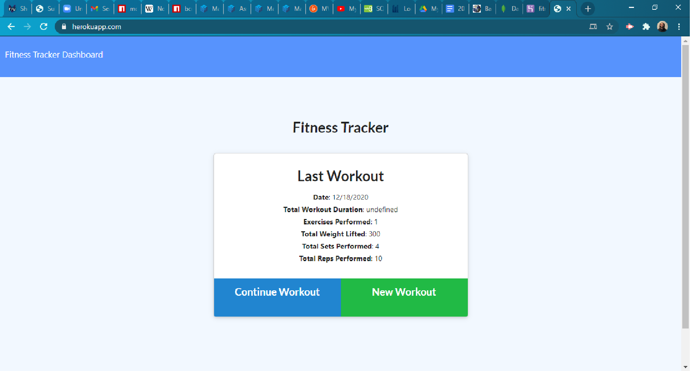

# FitnessTracker

## Description
Application to track workouts and progress

Link to live site: [FitnessTracker](https://kileelucero.github.io/FitnessTracker/)

## Table of Contents

* [Installation](#installation)
* [Usage](#usage)
* [Contribution](#contribution)
* [Tests](#tests)
* [License](#license)
* [Questions](#questions)

## Installation
Deploy app: https://fitness-tracker-237.herokuapp.com/?id=5fdd2deee6759a0017b962cb
## Usage
Used to see your progress visually
## License
none
Copyright (c) 2020 Kilee Lucero
## Contribution
When contributing to this repository, please first discuss the change you wish to make via issue, email, or any other method with the owner(s) of this repository before making a change.
## Tests
None
## Questions
For any questions the author can be contacted at:
GitHub: @[kileelucero](https://github.com/kileelucero)
Email: kileelucero@gmail.com
